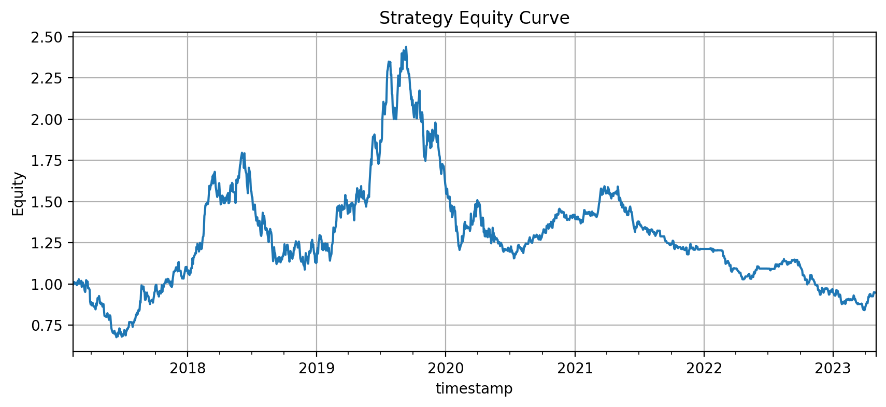

# Quant Research Lab: Systematic Strategy Evaluation

This repository is a compact, reproducible research project for quant internship applications.

The goal is **not** to claim a profitable trading strategy.  
The goal is to demonstrate a clean research workflow for systematic strategy evaluation:

- financial time-series feature engineering
- event labeling inspired by triple-barrier ideas
- walk-forward / time-series validation
- transaction-cost-aware backtesting
- risk-adjusted performance analysis
- clear discussion of limitations

## Project Motivation

Many beginner trading projects only implement indicators such as RSI, MACD, or moving-average crossovers.  
This project instead focuses on the research process that quant teams care about:

1. define a hypothesis,
2. build features without look-ahead leakage,
3. train and validate models using time-aware splits,
4. convert predictions into positions,
5. evaluate returns after costs,
6. analyze risk and failure modes.

## Repository Structure

```text
quant-research-lab/
├── src/quant_lab/
│   ├── data.py          # data loading and synthetic market generation
│   ├── features.py      # technical features and event labels
│   ├── validation.py    # walk-forward split utilities
│   ├── models.py        # baseline ML models
│   ├── backtest.py      # vectorized backtester
│   └── metrics.py       # performance and risk metrics
├── notebooks/
│   └── 01_research_workflow.ipynb
├── scripts/
│   └── run_experiment.py
├── reports/
│   └── research_report.md
├── tests/
│   └── test_core.py
├── requirements.txt
└── README.md
```
## Research Hypothesis

This project tests whether lagged price and volume features contain predictive information about short-term future return direction.

The hypothesis is that recent returns, volatility, moving-average distance, breakout features, and volume changes may help predict whether the asset will move up, down, or remain flat over the next five trading days.

## Strategy Design

The strategy follows a simple machine-learning-based directional trading framework:

1. Generate lagged price and volume features from OHLCV data.
2. Label each date based on the 5-day forward return:
   - `1` if the forward return is above `+0.2%`
   - `-1` if the forward return is below `-0.2%`
   - `0` otherwise
3. Train a Random Forest classifier using walk-forward validation.
4. Convert model predictions into trading positions:
   - prediction `1` → long
   - prediction `-1` → short
   - prediction `0` → flat
5. Shift positions by one day to avoid look-ahead bias.
6. Evaluate the strategy after transaction costs.

## Interpretation

The current experiment did not produce robust positive performance. The strategy achieved a negative CAGR, a low Sharpe ratio, and a large maximum drawdown.

This suggests that the current feature set and model are not sufficient to generate a stable trading strategy under the tested assumptions. Future improvements should include benchmark comparison, transaction cost sensitivity analysis, feature importance analysis, and testing on real market data.

## Research Question

> Can simple price/volume features produce a direction signal that improves risk-adjusted return after realistic transaction costs?

This is intentionally modest. A strong quant project should be honest about uncertainty, costs, overfitting, and data limitations.

## Methodology

### Data

By default, the project uses a synthetic OHLCV market generator so the repository is fully runnable without proprietary data.  
You can replace it with your own CSV using the following columns:

```text
timestamp, open, high, low, close, volume
```

### Features

The project builds only lagged features:

- returns over multiple horizons
- rolling volatility
- moving-average distance
- z-score of price
- volume change
- breakout-style high/low features

### Labeling

The baseline label is a future return direction label:

```text
label = 1 if forward_return > threshold
label = -1 if forward_return < -threshold
label = 0 otherwise
```

This is inspired by financial ML labeling ideas, but the implementation is original and simplified for a public GitHub project.

### Validation

The experiment uses walk-forward splits to avoid random train/test leakage.

### Backtest

Predicted signals are converted into long/short/flat positions.

The backtest includes:

- transaction costs
- turnover
- cumulative returns
- drawdown
- Sharpe ratio
- Sortino ratio
- Calmar ratio
- hit rate

## Quickstart

```bash
git clone <your-repo-url>
cd quant-research-lab
python -m venv .venv
source .venv/bin/activate  # Windows: .venv\Scripts\activate
pip install -r requirements.txt
python scripts/run_experiment.py
```

The script prints a performance table and writes output to:

```text
reports/experiment_results.csv
reports/equity_curve.csv
```

## Example Output

| Strategy | CAGR | Volatility | Sharpe | Max Drawdown | Turnover |
|---|---:|---:|---:|---:|---:|
| ML Direction Signal | generated by script | generated by script | generated by script | generated by script | generated by script |

## Important Limitations

This project is for research and education only.

- Synthetic data is not a substitute for real market data.
- Results can be sensitive to transaction costs and threshold choices.
- The model may overfit if too many features or hyperparameters are added.
- No market impact, liquidity constraint, borrow cost, or exchange fee schedule is modeled.
- Past performance does not imply future performance.

## How This Helps in Quant Internship Screening

This repository demonstrates:

- Python package structure
- pandas/numpy/sklearn workflow
- time-series validation awareness
- backtesting discipline
- risk metrics
- readable documentation
- honest research communication

## Next Improvements

- Replace synthetic data with liquid equity or futures data
- Add purged cross-validation with embargo
- Add triple-barrier event labeling
- Add portfolio-level position sizing
- Add factor neutralization
- Add Bayesian or nested hyperparameter search

## Strategy Equity Curve




## Performance

| Metric | Value |
|---|---:|
| CAGR | -0.0084 |
| Sharpe Ratio | 0.1085 |
| Max Drawdown | -0.655 |

## Interpretation

The strategy did not generate robust positive returns in this experiment. Although the model produced trading signals through a walk-forward validation process, the final performance was weak, with a negative CAGR, low Sharpe ratio, and large maximum drawdown.

This suggests that the current feature set and signal construction are not sufficient to produce a stable trading strategy. Further work should include benchmark comparison, transaction cost sensitivity analysis, feature importance analysis, and more robust risk control.
